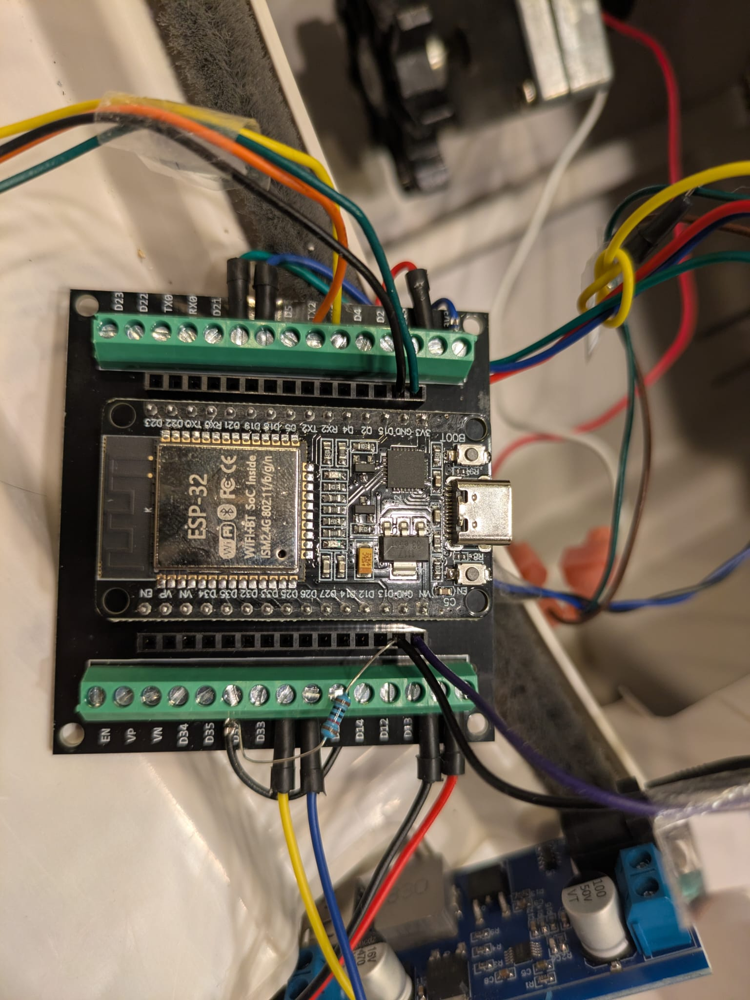
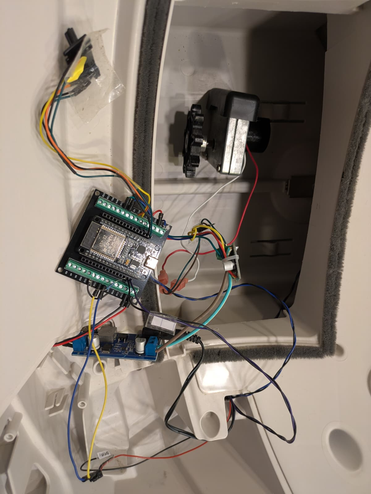
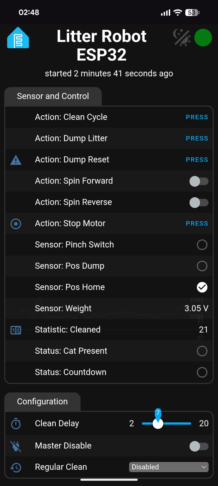

# ESP32 Litter-Robot 3 Custom Controller

A complete, open-source custom logic board replacement for the Litter-Robot 3 using an ESP32 and ESPHome. 

This project bypasses the proprietary Globe Electronics mainboard and DFI (Drawer Full Indicator), replacing them with standard, easily repairable components while maintaining full functionality of the globe motor, weight sensing, and safety pinch detection.

## Hardware Setup & Photos

*Custom ESP32 logic board and harness wiring.*

*Bypassed pinch contacts and sensor routing.*

*Mobile phone interface capture.*

## Bill of Materials (BOM)

Here is the exact hardware used in this build:

*   **Microcontroller & Breakout:** [30PIN ESP32 ESP-32S Type-C USB CP2102 + Breakout Board Shield](https://www.amazon.de/dp/B0D2TJ59BF)
*   **Motor Control:** [Wcawnlt DRV8871 1.5A 2-Channel H-Bridge DC Motor Driver](https://www.amazon.de/dp/B0H4LZ6J6D) (Drives the main globe rotation)
*   **Power Step-Down:** [AYWHP DC-DC 24V/12V to 5V 5A Buck Converter](https://www.amazon.de/dp/B0FPFSBWHY) (Steps down the Litter-Robot's native 15V barrel jack supply to power the ESP32)
*   **Safety Switch:** Stock metal pinch contacts (wired directly to ESP32, proprietary DFI board bypassed)
*   **Position Detection:** Hall Effect Sensors (for detecting the globe's Home and Dump positions)
*   **Weight Detection:** Stock weight sensor (wired with a 10kΩ resistor)

*(Note: A custom drawer-full sensing solution using a Time-of-Flight sensor is currently pending integration.)*

## Pinout / Wiring Guide

*Note: Update the GPIO pins below to match your specific layout. The DRV8871 uses IN1 and IN2 directly for both direction and PWM speed control.*

| Component | ESP32 Pin | Notes |
| :--- | :--- | :--- |
| **Pinch Sensor (Contact 1)** | `GPIO 26` | Configured as `INPUT_PULLUP` |
| **Pinch Sensor (Contact 2)**| `GPIO 25` | Configured as fake GND (`output` turned off) |
| **Motor Driver (IN1)** | `GPIO 18` | PWM Direction 1 (Forward) |
| **Motor Driver (IN2)** | `GPIO 19` | PWM Direction 2 (Reverse) |
| **Hall Sensor (Home)** | `GPIO 17` | Triggers LOW when magnet aligns |
| **Hall Sensor (Dump)** | `GPIO 16` | Triggers LOW when magnet aligns |
| **Weight Sensor** | `GPIO 32` | Read via ADC (wired with a 10kΩ resistor) |

## Reverse-Engineering the Stock DFI Sensor

During the development of this project, extensive testing was done to see if the stock Drawer Full Indicator (DFI) could be read directly by the ESP32. 

Here is what was discovered, and why the stock sensor is bypassed in this project:

*   **Communication Protocol:** The sensor array runs on a 5V **I2C bus**. An I2C scanner successfully detects two distinct addresses on the line: `0x20` and `0x24`, representing the separated emitter and receiver boards.
*   **The Hardware:** Peeling back the potting compound reveals a **Microchip PIC16F15313**. This is a programmable 8-bit microcontroller, meaning the sensor is not a generic, standard I/O expander.
*   **The Proprietary Handshake:** The PIC chip runs custom factory firmware. It is programmed to sit entirely dormant until it receives a highly specific, proprietary sequence of command bytes from the stock mainboard to activate the infrared LEDs.
*   **The Result:** Attempting to read standard registers from `0x20` and `0x24` simply returns streams of `0`s. Even attempting to write `0xFF` to the bus to force the I/O pins HIGH fails to wake the sensor up. The receiver remains dark and returns nothing.

**Conclusion:** The stock DFI assembly acts as a digital black box. Without hooking a hardware logic analyzer up to a functioning stock unit to sniff the secret I2C handshake, triggering the sensor via an ESP32 is functionally impossible. Bypassing it entirely in favor of direct hardware switches and standard ranging sensors is the most reliable path forward.

## Firmware

This project uses **ESPHome**. Flash the provided `ESPHome.yaml` file to your ESP32 to integrate the sensors seamlessly.
